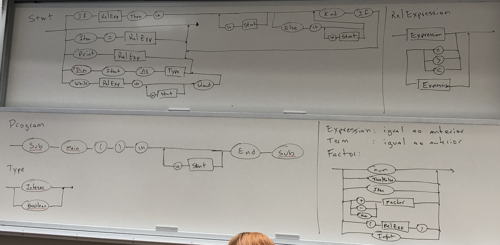
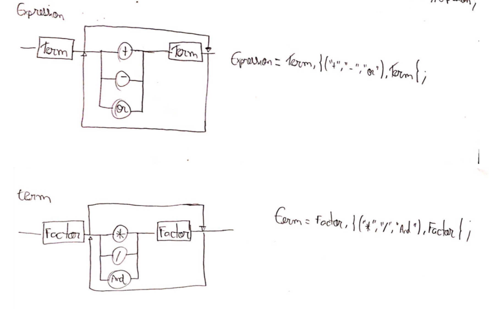

# raphael_compiler
Repositório para desenvolvimento do compilador da matéria de Lógica da Computação.



```
Stmt =  Null, 
        "If" RelExp "Then" "\n" (Null | Stmt "\n") (Null | Else "\n" (Null | Stmt "\n"))
        Ident "=" RelExp,
        "Print" RelExp,
        "Dim" Ident "as" Type,
        "While" RelExp "\n" (Null | Stmt "\n") "End" "Sub"
```

```
RelExp = Expression (Null | "=" | ">" | "<") Expression 
```

```
Program = "Sub" "Main" "(" ")" "\n" (Null | Stmt "\n") "End" "Sub"
```

```
Type = ("Integer" | "Boolean")
```

```
Factor = (num | ("True" | "False") | Iden | ("+"|"-"|"Not") Factor | "(" RelExp ")" | "Input")
```

```
Expression = Term, {("+","-","or"), Term}
```

```
Term = Factor, {("*","/","and"), Factor}
```